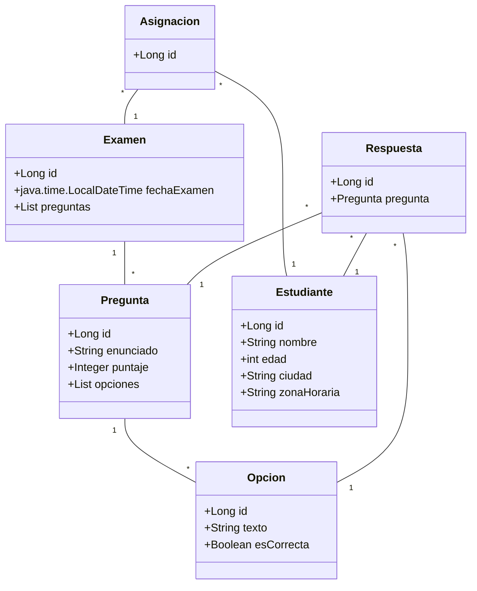

# examen-api
## **Introducción**

La aplicación es un sistema integrado diseñado para administrar, asignar y evaluar exámenes. Es una aplicación basada en Java, utilizando el marco de trabajo Spring Boot, lo cual permite la creación de APIs RESTful para la interacción con el frontend. Usa una base de datos MySQL para el almacenamiento persistente de datos.

## **Arquitectura del Sistema**

La aplicación sigue una arquitectura de diseño modular y multicapa que permite separar de forma efectiva la lógica de negocios, el acceso a datos y la presentación, haciendo la aplicación robusta, escalable y mantenible.

1.  **Capa de Presentación**
    
    -   **Controladores**: Gestionan las solicitudes HTTP y delegan el procesamiento a los servicios correspondientes.
2.  **Capa de Negocio**
    
    -   **Servicios**: Contienen la lógica de negocios y gestionan las transacciones entre los repositorios y los controladores.
3.  **Capa de Acceso a Datos**
    
    -   **Repositorios**: Gestionan la interacción con la base de datos.

## **Entidades y Relaciones**

## **Especificaciones de Entidades**

1.  **Examen**: Cada examen contiene una lista de preguntas y está asociado con una fecha de examen.
2.  **Pregunta**: Cada pregunta tiene un enunciado, un puntaje y una lista de opciones.
3.  **Opcion**: Representa una opción de respuesta con texto y un valor booleano que indica si la opción es correcta.
4.  **Estudiante**: Los estudiantes tienen datos básicos como nombre, edad, ciudad y zona horaria.
5.  **Asignacion**: Relaciona a los estudiantes con los exámenes que deben rendir.
6.  **Respuesta**: Almacena las respuestas seleccionadas por los estudiantes para cada pregunta.

## **API Endpoints**

La aplicación expone un conjunto de APIs RESTful para permitir la interacción con el sistema:

1.  **/api/examenes**
    
    -   Método: POST
    -   Descripción: Permite la creación de nuevos exámenes.
2.  **/api/estudiantes**
    
    -   Método: POST
    -   Descripción: Permite la creación de nuevos estudiantes.
3.  **/api/asignaciones**
    
    -   Método: POST
    -   Descripción: Asigna un examen específico a un estudiante.
4.  **/api/respuestas**
    
    -   Método: POST
    -   Descripción: Permite a los estudiantes enviar respuestas para un examen.
5.  **/api/calificacion**
    
    -   Método: GET
    -   Descripción: Obtiene la calificación de un estudiante en un examen específico.